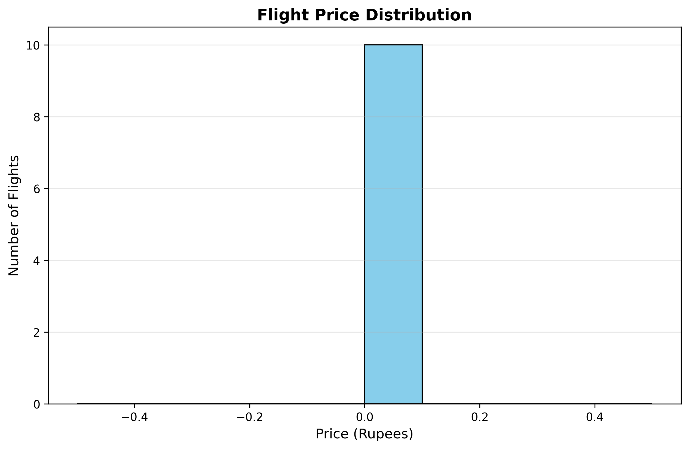
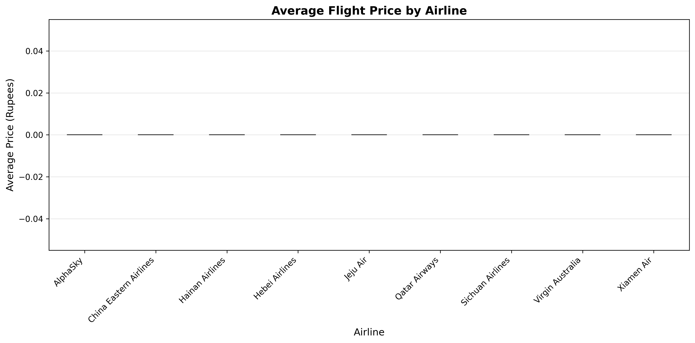
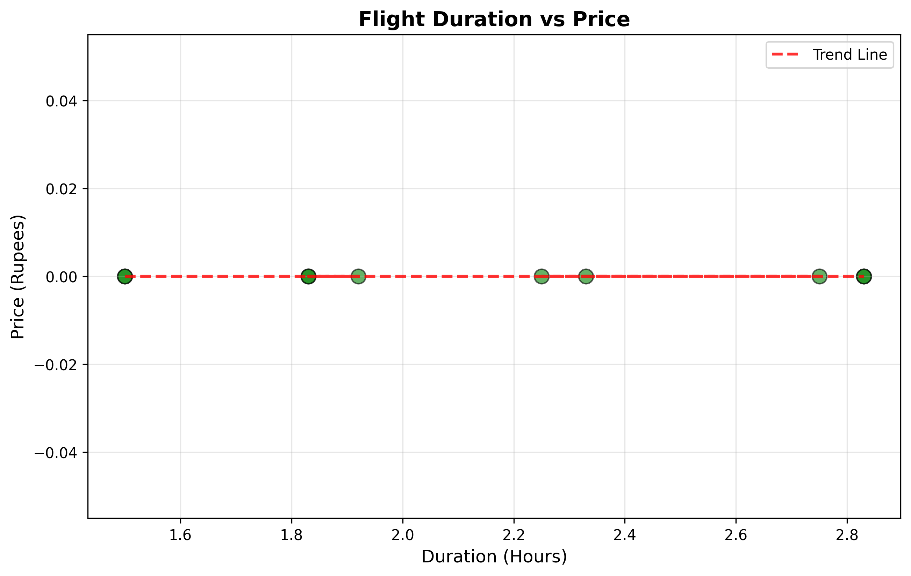

# flight-intelligence-system
AI-Powered Flight Intelligence System built using python, pandas, NumPy, APIs, and Matplotlib.
This system analyzes worldwide flight data, simulates airline pricing, calculates flight durations, recommends optimal flights using AI-based logic, and visualizes travel insights through professional charts.
#Features
##Flight Search Engine
-Search flights between airports worldwide.
-Real-time flight data integration using API.
-Smart filtering system.

##Duration Calculation Engine
-Calculates flight durations automatically.
-Handles departure and arrival timestamps.

##AI Recommendation System
-Recommends best flights based on:
 -Price
 -Duration
 -Airline Quality
-AI-based mechanism

##Visualization System
-Flight Price distribution charts.
-Airline comparison graphs.
-Duration vs Price analysis.

##Data Processing
-Data cleaning.
-Missing value handling.
-Price normalization.
-Data transformation using pandas and NumPy.

##Technologies Used
-Python
-pandas
-NumPy
-Requests
-Matplotlib
-Flight APIs

#Project Structure
'''bash
flight-intelligence-system/
api/
data/
input/
intelligence/
processor/
visualization/

LICENSE
README.md
main.py
test_export.py
test_visualization.py
verify_excel.py
'''

#Project Screenshots
##Price Distribution Chart
-
##Airline Price Comparison

##Duration vs Price Analysis

#Run the project
'''bash
python main.py

#AI Logic Used
The recommendation engine uses a custom scoring algorithm based on :
-Lower Ticket Prices.
-Shorter Flight Durations.
-Airline Quality Weighting.
The system normalizes flight pricing data and generates intelligent recommendations.

#Future Improvements
-Live ticket booking integration.
-MAchine Learning price prediction.
-Interactive dashboard.
-Multi-city route optimization.
-Real-time cheapest flight alerts.

#Developer
Built by Vihan Anand
Focused on AI systems, data intelligence, and real-world python projects.

